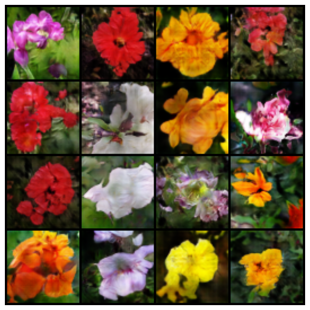

# Simple DCGAN in PyTorch

# Implementation Details
* normalized dataset's img by `mean=(0.5, )`, `std = (0.5, )` to range`(-1.0, 1.0)`
* generator's output activation should be Tanh
* discriminator's output activation should be sigmoid
* discriminator solve the problem as a classification problem
* for discriminator, the generators' output should be classified as 0, the real data should be classified as 1
* generator aim to fool the discrimintor classify its output as 1
* use `[conv/convtranspose]-[groupnorm]-[silu]` as basic block
* should not stack too many blocks, otherwise the training fails, in this implementation, no additional conv block between upsample or downsample block 

# Results
